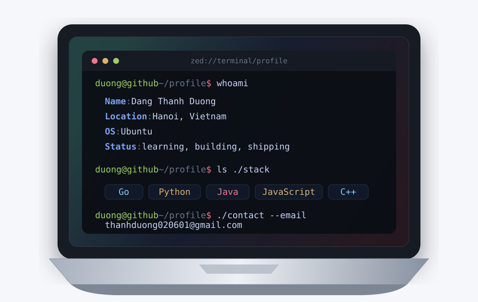

<div align="center">

# dangthanhduong01



</div>

<!-- ```bash
duong@github ~/profile
$ git status
```

```text
On branch main
Currently exploring: AI agents, model building, and practical software engineering
```

```bash
duong@github ~/profile
$ cat ./interests.txt
```

```text
Coding
Reading
Watching
Relaxing
``` -->
